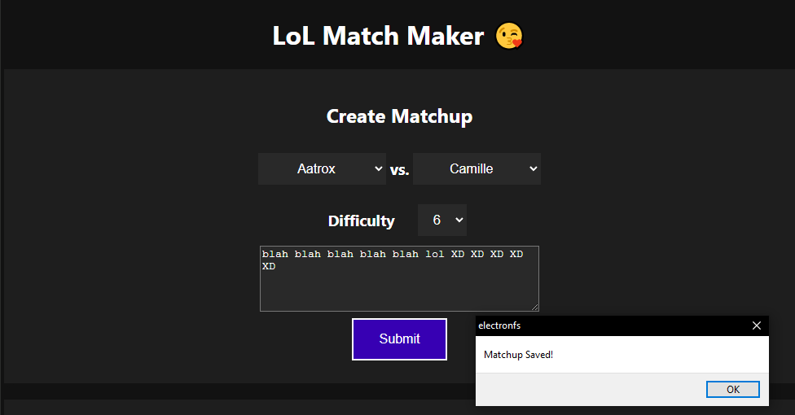
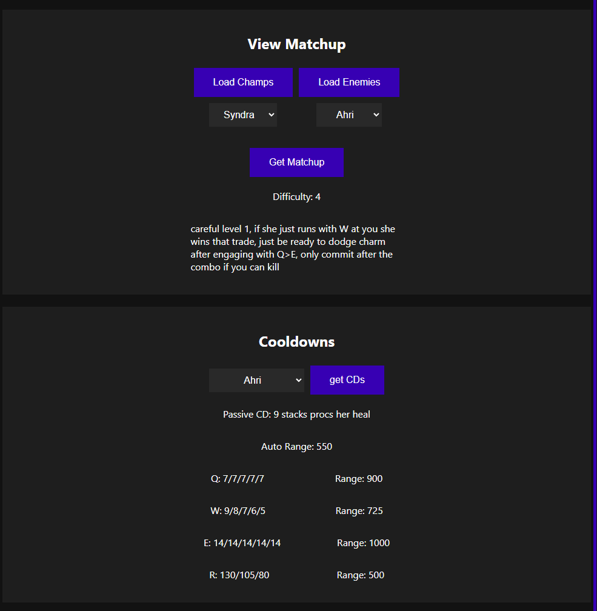

# LoL Matchup Maker

LoL Matchup Maker is a desktop application made for taking notes on specific champion matchups and allowing you to reference them quickly during champion select. There is also a champion ability cooldown/range reference tool included.

## Installation

Download the latest release. The release number matches what patch it is currently up to date with, (for example, 1.13.5 is up to date with patch 13.5 of League of Legends). A new release is posted here the day of league patches to update the cooldown information. Or if I haven't updated it for a specific patch, you can easily update the `cooldowns.json` file yourself to keep it up to date.

## Screenshots

## Contributing

Pull requests are welcome. For major changes, please open an issue first
to discuss what you would like to change.

## License

[MIT](https://choosealicense.com/licenses/mit/)